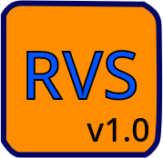

# RevanScript (RVS) Programming Language Project
An efficient, lightweight, and direct execution interpreter model built from scratch.

<p align="center">
  
</p>

## 📖 Introduction
**RevanScript (RVS)** sadə, command-based (əmr əsaslı) təmələ sahib bir proqramlaşdırma dilidir. Olduqca minimal və anlaşılan bir sintaksisə malikdir. RevanScript (RVS) dilinin əsas üstünlüyü onun sürətli və yüngül işləyən daxili tərcüməçi (interpreter) proqramına sahib olmasıdır. 

Layihə tamamilə **C proqramlaşdırma dili** ilə sıfırdan hazırlanmışdır.

## 💎 Data Types
Dildə müxtəlif məlumat tiplərinin idarə edilməsi nəzərdə tutulmuşdur. Hazırda aşağıdakı primitiv tiplər tam işlək vəziyyətdədir:
* **String** (Mətn tipi)
* **Integer** (Tam ədəd tipi)
* **Float** (Kəsr ədəd tipi)
* **Boolean** (Məntiq tipi)
* **Null** (Boşluq tipi)

## 📂 Project Layers & Architecture
RevanScript layihəsi modulyar arxitekturaya malikdir və aşağıdakı C faylları (Layers) vasitəsilə idarə olunur:

1. **Memory Management:** `src/rvsmem.c` | `include/rvsmem.h`
2. **Buffer Memory Management:** `src/rvsbuf.c` | `include/rvsbuf.h`
3. **Expression Memory Management:** `src/rvsexp.c` | `include/rvsexp.h`
4. **I/O Handling:** `src/rvsio.c` | `include/rvsio.h`
5. **Interpreter Flags:** `src/rvsflg.c` | `include/rvsflg.h`
6. **Control & Checking:** `src/rvsctl.c` | `include/rvsctl.h`
7. **Math Engine:** `src/rvsmth.c` | `include/rvsmth.h`

## 💻 RevanScript Code Examples
Aşağıda RevanScript (RVS) dilinin əsas əmrlərini və sintaksisini göstərən sadə nümunə kod verilmişdir:

```custom
... RevanScript (RVS) Comment 
var text = "Hello, World!\n" 
out text 
set text = "\t\c4RevanScript (RVS) Programming Language\n" 
out text 
inp text 
out text 
cst text 
del text 
```

## 🌐 Community & Official Links
RevanScript inkişaf prosesini izləmək və layihəyə dəstək olmaq üçün aşağıdakı rəsmi resurslardan istifadə edə bilərsiniz:

* **📺 YouTube Tutorials:** [RvCodes9 YouTube Channel](https://youtube.com/@RvCodes9) — Praktik nümunələr və video bələdçilər.
* **📄 Official Documentation:** [RevanScript Pages Site](https://rvcodes9.github.io/RevanScript-RVS-Documetation-Site/) — Geniş məlumat və dərsliklər.
* **💬 Reddit Community:** [r/RevanScript](https://www.reddit.com/r/RevanScript/) — Fikir bildirmək, müzakirə etmək və sual vermək üçün rəsmi sub-reddit.

## 💡 Creator
RevanScript (RVS) 2026 ci ildə 4 aprel yaradılmış bir proqramlaşdırma dili lahiyəsidir. Proqramlaşdırma dilinin yaradıcısi Rəvan Babayev (Revan Babayev) dir. RevanScript (RVS) hazırda aktiv inkişaf etməkdə olan lahiyədir.